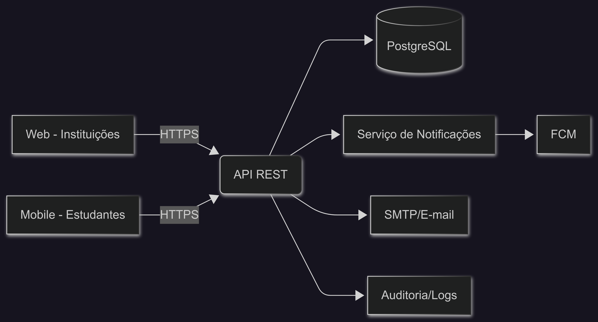

# Arquitetura do Sistema

## Visão Geral
Camadas:  
- UI Web (instituições)  
- Mobile (estudantes)  
- API REST  
- Serviço de Notificação  
- Banco de Dados relacional  

Autenticação: JWT + RBAC.  
Integrações: e-mail SMTP, push FCM.  

## Diagrama de Componentes

## Decisões Técnicas
- PostgreSQL para consistência transacional.  
- JWT com refresh tokens.  
- Rate limiting e CORS configuráveis.  
- Infra com Docker.  
